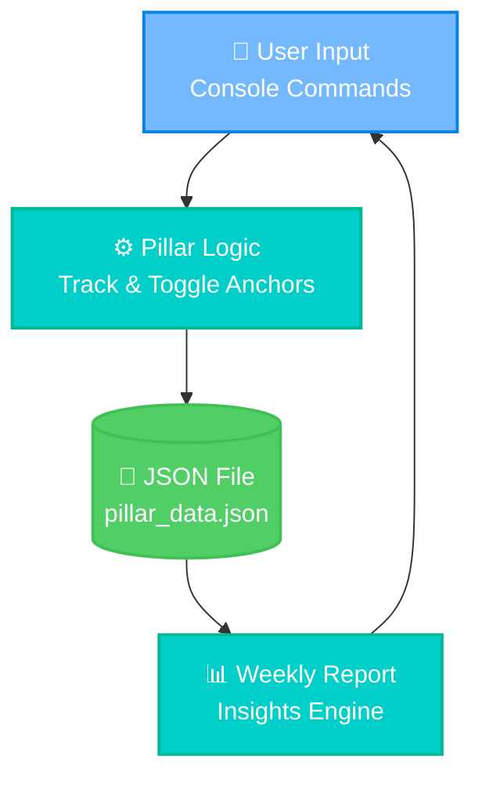
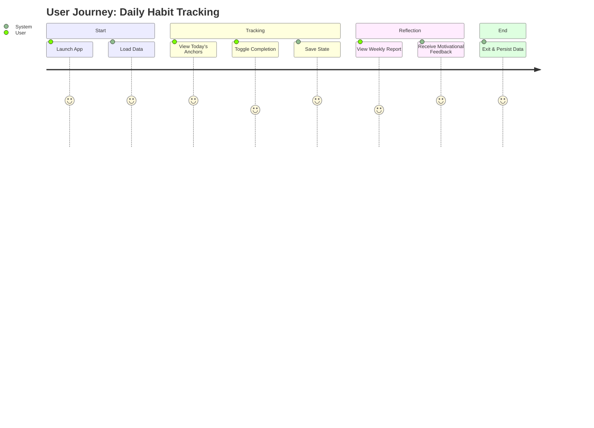
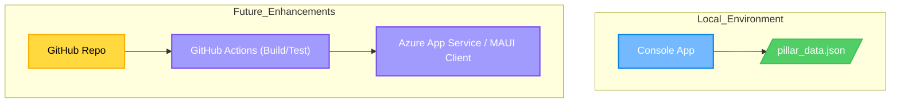

# ⚡ Pillar – Life Anchors System  
*A universal daily balance tracker built with C# and .NET 8.0: designed for simplicity, resilience, and growth.*  

## 🏅 Tech Stack
  
  
  
  
  

## 📚 Table of Contents  
- [🎯 Objective](#-objective)  
- [💡 Expected Benefit](#-expected-benefit)  
- [🚀 Features](#-features)  
- [🗂️ Folder Structure](#️-folder-structure)  
- [🧠 Architecture](#-architecture)  
- [📦 Recommended Resources](#-recommended-resources)  
- [🤝 Contributing](#-contributing)  
- [🛣️ Roadmap](#️-roadmap)  
- [📜 License](#-license)  

## 🎯 Objective  
**Pillar** is a **life anchors system**: a structured daily tracker that helps individuals stay balanced across three essential domains:  
- 🧱 **Core Anchors** – health & self-care  
- 🌐 **Connection Anchors** – relationships & social touchpoints  
- 🎯 **Growth Anchors** – learning & personal development  

The goal is to provide **clarity, consistency, and insight** for building habits that compound into resilience.  

## 💡 Expected Benefit  
- **Who:** Students, professionals, and anyone seeking sustainable well-being.  
- **What:** A local console-based app with structured tracking.  
- **When:** Daily check-ins and weekly reflection.  
- **Where:** Works on any machine with .NET 8 installed.  
- **Why:** Anchors stabilize daily life, reduce stress, and promote growth.  

*(Disclaimer: Benefits vary; this app is not a medical tool.)*  

## 🚀 Features  
1. ✅ Track 10 default life anchors across Core, Connection, and Growth.  
2. 📊 Daily dashboard with completion progress bar.  
3. 🗓️ Weekly balance reports with motivational insights.  
4. 💾 Persistent storage via JSON (`pillar_data.json`).  
5. ⚙️ Settings panel for managing active/inactive anchors.  
6. 🔮 Roadmap-ready for streaks, reminders, and goal-setting.  

## 🗂️ Folder Structure  
```

/pillar
├── bin/Debug/net8.0
├── obj
├── Pillar.csproj
├── Pillar.sln
├── Program.cs
├── Practice.cs
├── Raw\.cs
├── pillar\_data.json
└── README.md

````

---

## 🧠 Architecture  

### 🏗️ System Architecture Overview  
```mermaid
graph TB
    subgraph "🌐 Client Layer"
        CLI[🖥️ Console Interface]:::uiColor
    end
    
    subgraph "⚙️ Application Layer"
        Tracker[⚓ Pillar Tracker]:::appColor
        Logic[🧠 Habit Logic & Reports]:::appColor
    end
    
    subgraph "💾 Data Layer"
        JSON[(📄 JSON Store pillar_data.json)]:::dataColor
    end
    
    subgraph "📊 Monitoring"
        LocalLogs[📝 Console Output Logs]:::infraColor
    end

    CLI --> Tracker
    Tracker --> Logic
    Logic --> JSON
    Logic --> LocalLogs

    classDef uiColor fill:#74b9ff,stroke:#0984e3,stroke-width:2px,color:#fff
    classDef appColor fill:#00cec9,stroke:#00b894,stroke-width:2px,color:#fff
    classDef dataColor fill:#51cf66,stroke:#40c057,stroke-width:2px,color:#fff
    classDef infraColor fill:#a29bfe,stroke:#7950f2,stroke-width:2px,color:#fff
````

### 🔧 Detailed Component Architecture

```mermaid
graph TB
    subgraph "Application"
        Menu[🎯 Main Menu]:::appColor
        Anchors[📋 Life Anchors]:::appColor
        Reports[📊 Weekly Report Generator]:::appColor
        Settings[⚙️ Settings Manager]:::appColor
    end

    subgraph "Persistence"
        JSON[(📄 pillar_data.json)]:::dataColor
    end

    Menu --> Anchors
    Menu --> Reports
    Menu --> Settings
    Anchors --> JSON
    Reports --> JSON
    Settings --> JSON

    classDef appColor fill:#00cec9,stroke:#00b894,stroke-width:2px,color:#fff
    classDef dataColor fill:#51cf66,stroke:#40c057,stroke-width:2px,color:#fff
```

### 📈 Data Flow Diagram



### 🔄 Information Flow & User Journey



### 🚀 Deployment & Infrastructure Blueprint



---

## 📦 Recommended Resources

* [.NET 8 Documentation](https://learn.microsoft.com/dotnet/core)
* [C# Language Reference](https://learn.microsoft.com/dotnet/csharp/)
* [Mermaid.js for Diagrams](https://mermaid.js.org/)
* [BJ Fogg Behavior Model](https://behaviormodel.org/)

## 🤝 Contributing

* Fork → Branch → Commit → PR workflow.
* Issues welcome via GitHub tracker.
* Coding standards: **C# 12**, **Async/Await**, **Clean Architecture principles**.
* Community rules: respectful, constructive contributions only.

## 🛣️ Roadmap

* [ ] Custom Anchor Creation
* [ ] Streak Tracking & Notifications
* [ ] Goal Setting & Reminders
* [ ] Data Export (CSV/Excel)
* [ ] Cross-platform GUI (MAUI/WPF)

## 📜 License

MIT License. See [LICENSE](LICENSE).

